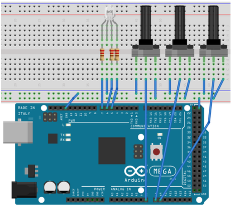
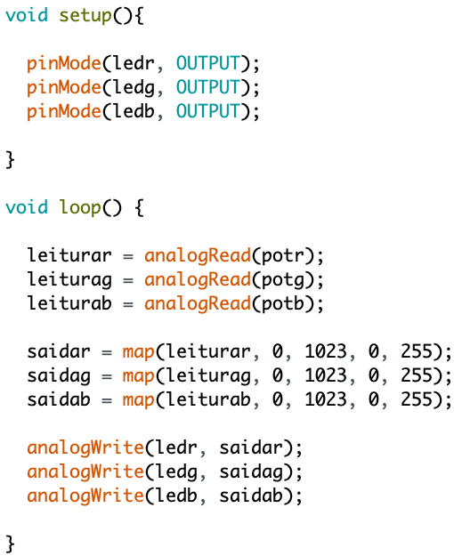

# Arduino para Iniciantes

Material utilizado em meu curso *Arduino para Iniciantes*.

Foco em alunos sem qualquer conhecimento prévio em eletrônica ou programação.

Os exercícios estudados em sala de aula estão na pasta exercises.

As notas de aula projetadas em sala, estão no arquivo "notas_de_aula_rev_1.pdf"

Bons estudos!

## Demonstração do conteúdo
### Hardware

### Software

